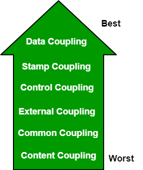
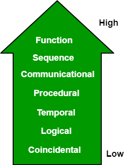
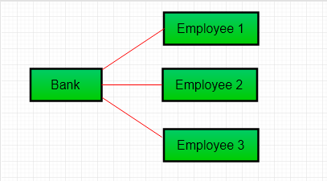
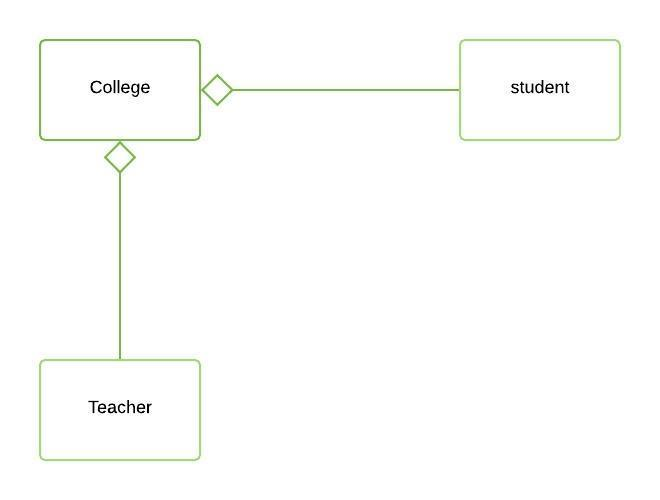
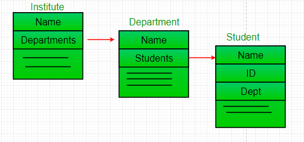

# Contents

- [Contents](#contents)
- [Software Engineering | Coupling and Cohesion](#software-engineering--coupling-and-cohesion)
  - [Coupling](#coupling)
  - [Cohesion](#cohesion)
- [Software Engineering | Association, Aggregation \& Composition](#software-engineering--association-aggregation--composition)
  - [Association](#association)
  - [Aggregation](#aggregation)
  - [Association vs Aggregation](#association-vs-aggregation)
  - [Composition](#composition)
  - [Aggregation vs Composition](#aggregation-vs-composition)

# Software Engineering | Coupling and Cohesion

The purpose of Design phase in the Software Development Life Cycle is to produce a solution to a problem given in the **SRS**(Software Requirement Specification) document. The output of the design phase is **Software Design Document** (SDD).

**Coupling** and **Cohesion** are two key concepts in software engineering that are used to measure the quality of a software system’s design.

**Coupling** refers to the **degree of interdependence** between software modules. High coupling means that modules are closely connected and changes in one module may affect other modules. Low coupling means that modules are independent and changes in one module have little impact on other modules. **Generally loose coupled software is considered best.**

**Cohesion** refers to the **degree to which elements within a module work together** to fulfill a single, well-defined purpose. High cohesion means that elements are closely related and focused on a single purpose, while low cohesion means that elements are loosely related and serve multiple purposes. **Generally highly cohesive software is considered best.**

## Coupling

Coupling is the **measure of the degree of interdependence** between the modules. **A good software will have low coupling.**



Types of **coupling :**

-   **Data Coupling :** If the dependency between the modules is based on the fact that they communicate by passing only data, then the modules are said to be data coupled. In data coupling, the components are independent of each other and communicate through data. Module communications don’t contain tramp data. **Example-customer billing system.**
-   **Stamp Coupling :** In stamp coupling, the complete data structure is passed from one module to another module. Therefore, it involves tramp data. It may be necessary due to efficiency factors- this choice was made by the **insightful designer, not a lazy programmer.**
-   **Control Coupling :** If the modules communicate by passing control information, then they are said to be control coupled. It can be bad if parameters indicate completely different behavior and good if parameters allow factoring and reuse of functionality. **Example- sort function that takes comparison function as an argument.**
-   **External Coupling :** In external coupling, the modules depend on other modules, external to the software being developed or to a particular type of hardware. **Ex- protocol, external file, device format, etc.**
-   **Common Coupling :** The modules have shared data such as global data structures. The changes in global data mean tracing back to all modules which access that data to evaluate the effect of the change. So it has got disadvantages like difficulty in reusing modules, reduced ability to control data accesses, and reduced maintainability.
-   **Content Coupling :** In a content coupling, one module can modify the data of another module, or control flow is passed from one module to the other module. **This is the worst form of coupling and should be avoided.**

## Cohesion

**Cohesion** is a measure of the degree to which the elements of the module are functionally related. It is the degree to which all elements directed towards performing a single task are contained in the component. Basically, cohesion is the internal glue that keeps the module together. **A good software design will have high cohesion.**



Types of **cohesion :**

-   **Functional Cohesion :** Every essential element for a single computation is contained in the component. A functional cohesion performs the task and functions. It is an ideal situation.
-   **Sequential Cohesion :** An element outputs some data that becomes the input for other element, i.e., data flow between the parts. It occurs naturally in functional programming languages.
-   **Communicational Cohesion :** Two elements operate on the same input data or contribute towards the same output data. **Example- update record in the database and send it to the printer.**
-   **Procedural Cohesion :** Elements of procedural cohesion ensure the order of execution. Actions are still weakly connected and unlikely to be reusable. **Ex- calculate student GPA, print student record, calculate cumulative GPA, print cumulative GPA.**
-   **Temporal Cohesion :** The elements are related by their timing involved. A module connected with temporal cohesion all the tasks must be executed in the same time span. This cohesion contains the code for initializing all the parts of the system. Lots of different activities occur, all at unit time.
-   **Logical Cohesion :** The elements are logically related and not functionally. **Ex- A component reads inputs from tape, disk, and network.** All the code for these functions is in the same component. Operations are related, but the functions are significantly different.
-   **Coincidental Cohesion :** The elements are not related(unrelated). The elements have no conceptual relationship other than location in source code. It is accidental and the **worst form of cohesion**. **Ex- print next line and reverse the characters of a string in a single component.**

# Software Engineering | Association, Aggregation & Composition

## Association

**Association** is a relation between two separate classes which establishes through their Objects.
**Association** can be **one-to-one**, **one-to-many**, **many-to-one**, **many-to-many**.
In Object-Oriented programming, an Object communicates to another object to use functionality and services provided by that object.

**Composition** and **Aggregation** are the two forms of **association**.


**Example :**

```
// Java Program to illustrate the
// Concept of Association

// Importing required classes
import java.io.*;

// Class 1
// Bank class
class Bank {

	// Attributes of bank
	private String name;

	private Set<Employee> employees;
	// Constructor of this class
	Bank(String name)
	{
		// this keyword refers to current instance itself
		this.name = name;
	}

	// Method of Bank class
	public String getBankName()
	{
		// Returning name of bank
		return this.name;
	}

	public setEmployees(Set<Employee> employees){
		this.employees = employees;
	}
public getEmployees(Set<Employee> employees){
		return this.employees;
	}
}

// Class 2
// Employee class
class Employee {
	// Attributes of employee
	private String name;
	// Employee name
	Employee(String name)
	{
		// This keyword refers to current instance itself
		this.name = name;
	}

	// Method of Employee class
	public String getEmployeeName()
	{
		// returning the name of employee
		return this.name;
	}
}

// Class 3
// Association between both the
// classes in main method
class GFG {

	// Main driver method
	public static void main(String[] args)
	{

		// Creating objects of bank and Employee class
		Bank bank = new Bank("ICICI");
		Employee emp = new Employee("Ridhi");

		Set<Employee> employees = new HashSet<>();
		employees.add(emp);

		bank.setEmployees(employees);

		System.out.println(bank.getEmployees()+"are belongs to bank"+bank.getBankName());
	}
}

```

**Output :**

```
Ridhi is employee of ICICI
```

**Output Explanation :**
In the above example, two separate classes **Bank** and **Employee** are associated through their Objects. **Bank** can have many **employees**, So it is a one-to-many relationship.



## Aggregation

It is a special form of **Association** where :

-   It represents **Has-A’s** relationship.
-   It is a **unidirectional association** i.e. a one-way relationship. For example, a department can have students but vice versa is not possible and thus unidirectional in nature.
-   In **Aggregation**, both the entries can survive individually which means ending one entity will not affect the other entity.



**Example :**

```
// Java program to illustrate Concept of Aggregation

// Importing required classes
import java.io.*;
import java.util.*;

// Class 1
// Student class
class Student {

	// Attributes of student
	String name;
	int id;
	String dept;

	// Constructor of student class
	Student(String name, int id, String dept)
	{

		// This keyword refers to current instance itself
		this.name = name;
		this.id = id;
		this.dept = dept;
	}
}

// Class 2
// Department class contains list of student objects
// It is associated with student class through its Objects
class Department {
	// Attributes of Department class
	String name;
	private List<Student> students;
	Department(String name, List<Student> students)
	{
		// this keyword refers to current instance itself
		this.name = name;
		this.students = students;
	}

	// Method of Department class
	public List<Student> getStudents()
	{
		// Returning list of user defined type
		// Student type
		return students;
	}
}

// Class 3
// Institute class contains list of Department
// Objects. It is associated with Department
// class through its Objects
class Institute {

	// Attributes of Institute
	String instituteName;
	private List<Department> departments;

	// Constructor of institute class
	Institute(String instituteName,List<Department> departments)
	{
		// This keyword refers to current instance itself
		this.instituteName = instituteName;
		this.departments = departments;
	}

	// Method of Institute class
	// Counting total students of all departments
	// in a given institute
	public int getTotalStudentsInInstitute()
	{
		int noOfStudents = 0;
		List<Student> students;

		for (Department dept : departments) {
			students = dept.getStudents();

			for (Student s : students) {
				noOfStudents++;
			}
		}

		return noOfStudents;
	}
}

// Class 4
// main class
class GFG {

	// main driver method
	public static void main(String[] args)
	{
		// Creating object of Student class inside main()
		Student s1 = new Student("Mia", 1, "CSE");
		Student s2 = new Student("Priya", 2, "CSE");
		Student s3 = new Student("John", 1, "EE");
		Student s4 = new Student("Rahul", 2, "EE");

		// Creating a List of CSE Students
		List<Student> cse_students = new ArrayList<Student>();

		// Adding CSE students
		cse_students.add(s1);
		cse_students.add(s2);

		// Creating a List of EE Students
		List<Student> ee_students
			= new ArrayList<Student>();

		// Adding EE students
		ee_students.add(s3);
		ee_students.add(s4);

		// Creating objects of EE and CSE class inside
		// main()
		Department CSE = new Department("CSE", cse_students);
		Department EE = new Department("EE", ee_students);

		List<Department> departments = new ArrayList<Department>();
		departments.add(CSE);
		departments.add(EE);

		// Lastly creating an instance of Institute
		Institute institute = new Institute("BITS", departments);

		// Display message for better readability
		System.out.print("Total students in institute: ");

		// Calling method to get total number of students
		// in institute and printing on console
		System.out.print(institute.getTotalStudentsInInstitute());
	}
}

```

**Output**

```
Total students in institute: 4
```

**Output Explanation :**
In this example, there is an **Institute** which has no. of **departments** like **CSE**, **EE**. Every **department** has no. of **students**. So, we make an **Institute** class that has a reference to Object or no. of Objects (i.e. List of Objects) of the **Department** class. That means **Institute** class is associated with **Department** class through its Object(s). And **Department** class has also a reference to Object or Objects (i.e. List of Objects) of the **Student** class means it is **associated** with the **Student** class through its Object(s).

It represents a **Has-A relationship**. In the above example: **Student** **Has-A** **name.** **Student** **Has-A** **ID.** **Student** **Has-A** **Dept.** **Department** **Has-A** **Students** as depicted from the below media.



## Association vs Aggregation

-   **Association** is a **“has-a”** type relationship. **Association** establish the relationship b/w two classes using through their objects. **Association** relationship can be **one to one, One to many, many to one and many to many.**
-   **Aggregation** is based is on **"has-a"** relationship. **Aggregation** is a special form of **association**. In **association** there is not any classes (entity) work as owner but in **aggregation** one entity work as owner. In **aggregation** both entities meet for some work and then get separated. **Aggregation is a one way association.**

## Composition

**Composition** is a **"part-of"** relationship. Simply **composition** means mean use of instance variables that are references to other objects. In **composition** relationship both entities are interdependent of each other for example **“engine is part of car”, “heart is part of body”.**

**Composition** is a restricted form of **Aggregation** in which two entities are highly dependent on each other.

-   It represents **part-of** relationship.
-   In **composition**, both entities are dependent on each other.
-   When there is a **composition** between two entities, the composed object cannot exist without the other entity.

**Example - Library**

```
// Java program to illustrate
// the concept of Composition

// Importing required classes
import java.io.*;
import java.util.*;

// Class 1
// Book
class Book {

	// Attributes of book
	public String title;
	public String author;

	// Constructor of Book class
	Book(String title, String author)
	{

		// This keyword refers to current instance itself
		this.title = title;
		this.author = author;
	}
}

// Class 2
class Library {

	// Reference to refer to list of books
	private final List<Book> books;

	// Library class contains list of books
	Library(List<Book> books)
	{

		// Referring to same book as
		// this keyword refers to same instance itself
		this.books = books;
	}

	// Method
	// To get total number of books in library
	public List<Book> getTotalBooksInLibrary()
	{

		return books;
	}
}

// Class 3
// Main class
class GFG {

	// Main driver method
	public static void main(String[] args)
	{

		// Creating objects of Book class inside main()
		// method Custom inputs
		Book b1
			= new Book("EffectiveJ Java", "Joshua Bloch");
		Book b2
			= new Book("Thinking in Java", "Bruce Eckel");
		Book b3 = new Book("Java: The Complete Reference",
						"Herbert Schildt");

		// Creating the list which contains number of books
		List<Book> books = new ArrayList<Book>();

		// Adding books
		// using add() method
		books.add(b1);
		books.add(b2);
		books.add(b3);

		Library library = new Library(books);

		// Calling method to get total books in library
		// and storing it in list of user0defined type -
		// Books
		List<Book> bks = library.getTotalBooksInLibrary();

		// Iterating over books using for each loop
		for (Book bk : bks) {

			// Printing the title and author name of book on
			// console
			System.out.println("Title : " + bk.title
							+ " and "
							+ " Author : " + bk.author);
		}
	}
}

```

**Output**

```
Title : EffectiveJ Java and  Author : Joshua Bloch
Title : Thinking in Java and  Author : Bruce Eckel
Title : Java: The Complete Reference and  Author : Herbert Schildt
```

**Output Explanation :**

In the above example, a **library** can have no. of **books** on the same or different subjects. So, If **Library** gets destroyed then All **books** within that particular library will be destroyed. **i.e. books can not exist without libraries.** That’s why it is **composition.** **Book is Part-of Library.**

## Aggregation vs Composition

1. **Dependency :** **Aggregation** implies a relationship where the child can exist independently of the parent. For example, **Bank** and **Employee**, delete the **Bank** and the **Employee** still exist. whereas **Composition** implies a relationship where the child cannot exist independent of the parent. **Example: Human and heart, heart don’t exist separate to a Human**

2. **Type of Relationship:** **Aggregation** relation is **“has-a”** and **composition** is **“part-of”** relation.

3. **Type of association :** **Composition** is a **strong Association** whereas **Aggregation** is a **weak Association.**
