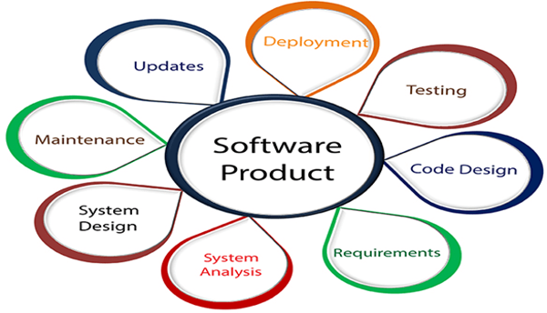
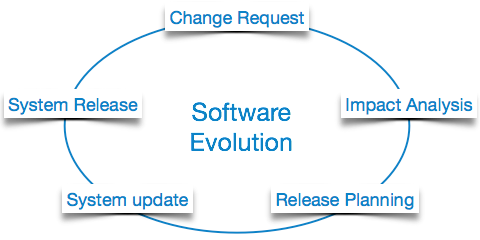
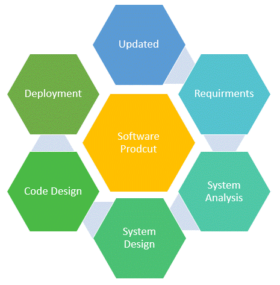
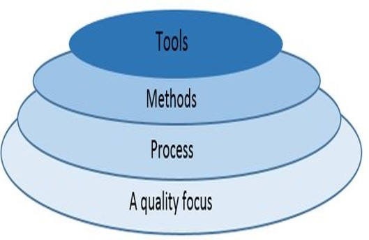
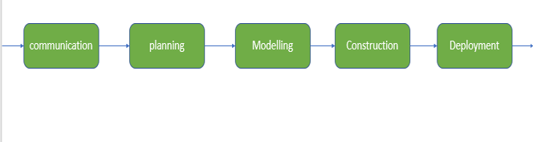

# Contents

-   [Contents](#contents)
-   [Introduction to Software Engineering](#introduction-to-software-engineering)
    -   [What is Software Engineering?](#what-is-software-engineering)
    -   [Why Software Engineering? Software Crisis \& its Solution:](#why-software-engineering-software-crisis--its-solution)
        -   [What was the Software Crisis?](#what-was-the-software-crisis)
        -   [The Solution](#the-solution)
    -   [Software Evolution](#software-evolution)
    -   [Why Software Engineering is Popular?](#why-software-engineering-is-popular)
    -   [Characteristics of software in software engineering:](#characteristics-of-software-in-software-engineering)
    -   [Key principles of Software Engineering](#key-principles-of-software-engineering)
    -   [Relationship of Software Engineering with Other Disciplines](#relationship-of-software-engineering-with-other-disciplines)
    -   [Challenges of Software Engineering](#challenges-of-software-engineering)
    -   [4 Attributes of Software Engineering](#4-attributes-of-software-engineering)
    -   [Characteristics of Good Software](#characteristics-of-good-software)
        -   [Operational](#operational)
        -   [Transitional](#transitional)
        -   [Maintenance](#maintenance)
-   [Evolving Role of Software](#evolving-role-of-software)
    -   [Dual Role of Software](#dual-role-of-software)
        -   [1. As a product](#1-as-a-product)
        -   [As a vehicle for delivering a product](#as-a-vehicle-for-delivering-a-product)
    -   [Changing Nature of Software](#changing-nature-of-software)
    -   [Legacy Software](#legacy-software)
-   [Layered Technology of Software Engineering](#layered-technology-of-software-engineering)

# Introduction to Software Engineering

**Software** is a program or set of programs containing instructions that provide desired functionality.

**Engineering** is the process of designing and building something that serves a particular purpose and finds a cost-effective solution to problems.

## What is Software Engineering?

**Software engineering** is the process of designing, developing, testing, and maintaining software. It is a systematic and disciplined approach to software development that aims to create high-quality, reliable, and maintainable software. Software engineering includes a variety of techniques, tools, and methodologies, including requirements analysis, design, testing, and maintenance.

Let’s look at the various definitions of software engineering:

-   IEEE, in its standard 610.12-1990, defines software engineering as the application of a systematic, disciplined, which is a computable approach for the development, operation, and maintenance of software.
-   Fritz Bauer defined it as ‘the establishment and used standard engineering principles. It helps you to obtain, economically, software which is reliable and works efficiently on the real machines’.
-   Boehm defines software engineering, which involves, ‘the practical application of scientific knowledge to the creative design and building of computer programs. It also includes associated documentation needed for developing, operating, and maintaining them.’

## Why Software Engineering? Software Crisis & its Solution:

### What was the Software Crisis?

-   It was in the late 1960s when many software projects failed.
-   Many software became over budget. Output was an unreliable software which is expensive to maintain.
-   Larger software was difficult and quite expensive to maintain.
-   Lots of software not able to satisfy the growing requirements of the customer.
-   Complexities of software projects increased whenever its hardware capability increased.
-   Demand for new software increased faster compared with the ability to generate new software.
    **All the above issues lead to ‘Software Crisis.’**

### The Solution

Solution was to the problem was transforming unorganized coding effort into a software engineering discipline. These engineering models helped companies to streamline operations and deliver software meeting customer requirements.

-   The late 1970s saw the widespread uses of software engineering principles.
-   In the 1980s saw the automation of software engineering process and growth of (CASE) Computer-Aided Software Engineering.
-   The 1990s have seen an increased emphasis on the ‘management’ aspects of projects standard of quality and processes just like ISO 9001

## Software Evolution

The process of developing a software product using software engineering principles and methods is referred to as **software evolution**. This includes the initial development of software and its maintenance and updates, till desired software product is developed, which satisfies the expected requirements. 

Evolution starts from the **requirement gathering process.** After which developers create a prototype of the intended software and show it to the users to get their feedback at the early stage of software product development. The users suggest changes, on which several consecutive updates and maintenance keep on changing too. This process changes to the original software, till the desired software is accomplished. 
Even after the user has desired software in hand, the advancing technology and the changing requirements force the software product to change accordingly. Re-creating software from scratch and to go one-on-one with requirement is not feasible. The only feasible and economical solution is to update the existing software so that it matches the latest requirements.

## Why Software Engineering is Popular?

Here are important reasons behind the popularity of software engineering:

-   **Large software :** In our real life, it is quite more comfortable to build a wall than a house or building. In the same manner, as the size of the software becomes large, software engineering helps you to build software.
-   **Scalability :** If the software development process were based on scientific and engineering concepts, it is easier to re-create new software to scale an existing one.
-   **Adaptability :** Whenever the software process was based on scientific and engineering, it is easy to re-create new software with the help of software engineering.
-   **Cost :** Hardware industry has shown its skills and huge manufacturing has lower the cost of the computer and electronic hardware.
-   **Dynamic Nature :** Always growing and adapting nature of the software. It depends on the environment in which the user works.
-   **Quality Management :** Offers better method of software development to provide quality software products.
     
    

## Characteristics of software in software engineering:

-   Software is **developed or engineered**; it is not manufactured in the classical sense:
    -   Although some similarities exist between software development and hardware manufacturing, few activities are fundamentally different.
-   The software doesn’t “**wear out.**”:
    -   There are no software spare parts.
    -   When a hardware component wears out, it is replaced by a spare part.
        The software continues to be custom-built:
    -   A software part should be planned and carried out with the goal that it tends to be reused in various projects.

## Key principles of Software Engineering

-   **Modularity :** Breaking the software into smaller, reusable components that can be developed and tested independently.
-   **Abstraction :** Hiding the implementation details of a component and exposing only the necessary functionality to other parts of the software.
-   **Encapsulation :** Wrapping up the data and functions of an object into a single unit, and protecting the internal state of an object from external modifications.
-   **Reusability :** Creating components that can be used in multiple projects, which can save time and resources.
-   **Maintenance :** Regularly updating and improving the software to fix bugs, add new features, and address security vulnerabilities.
-   **Testing :** Verifying that the software meets its requirements and is free of bugs.
-   **Design Patterns :** Solving recurring problems in software design by providing templates for solving them.
-   **Agile Methodologies :** Using iterative and incremental development processes that focus on customer satisfaction, rapid delivery, and flexibility.
-   **Continuous Integration & Deployment :** Continuously integrating the code changes and deploying them into the production environment.

## Relationship of Software Engineering with Other Disciplines

Here, how software engineering related to other disciplines:

-   **Computer Science :** Gives the scientific foundation for the software as electrical engineering mainly depends on physics.
-   **Management Science :** Software engineering is labour-intensive work which demands both technical and managerial control. Therefore, it is widely used in management science.
-   **Economics :** In this sector, software engineering helps you in resource estimation and cost control. Computing system must be developed, and data should be maintained regularly within a given budget.
-   **System Engineering :** Most software is a component of a much larger system. For example, the software in an Industry monitoring system or the flight software on an airplane. Software engineering methods should be applied to the study of this type of systems.

## Challenges of Software Engineering

Here are some critical challenges faced by software engineers:

-   In safety-critical areas such as space, aviation, nuclear power plants, etc. the cost of software failure can be massive because lives are at risk.
-   Increased market demands for fast turnaround time.
-   Dealing with the increased complexity of software need for new applications.
-   The diversity of software systems should be communicating with each other.

## 4 Attributes of Software Engineering

-   **Efficiency**
-   **Reliability**
-   **Robustness**
-   **Maintainability**

**Software = Program + Documentation + Licensing**

| Product Characteristics | Description                                                                                                                                           |
| ----------------------- | ----------------------------------------------------------------------------------------------------------------------------------------------------- |
| **Maintainability**     | The software should evolve to meet the changing demands of the clients.                                                                               |
| **Dependability**       | Dependability includes various characteristics. Dependable software should never cause any physical or economic damage at the time of system failure. |
| **Efficiency**          | The software application should overuse system resources like memory and processor cycle.                                                             |
| **Usability**           | The software application should have specific UI and documentation.                                                                                   |

**Optimizing the above attribute is very challenging. For example, offering a better UI can reduce system efficiency.**

## Characteristics of Good Software

Any software should be judged by what it offers and what are the methods which help you to use it.
Every software must satisfy the following attributes:

-   **Operational**
-   **Transitional**
-   **Maintenance**
    Here are some important characteristics of good software developed by software professionals

### Operational

This characteristic let us know about how well software works in the operations which can be measured on:

-   Budget
-   Efficiency
-   Usability
-   Dependability
-   Correctness
-   Functionality
-   Safety
-   Security

### Transitional

This is an essential aspect when the software is moved from one platform to another:

-   Interoperability
-   Reusability
-   Portability
-   Adaptability

### Maintenance

This aspect talks about how well software has the capabilities to adapt itself in the quickly changing environment:

-   Flexibility
-   Maintainability
-   Modularity
-   Scalability

# Evolving Role of Software

## Dual Role of Software

Today, software takes on a dual role. It is a **product** and, at the same time, the **vehicle for delivering a product.**

### 1. As a product

-   Delivers the computing potential across networks of Hardware.
-   Enables the Hardware to deliver the expected functionality.
-   Acts as an information transformer because it produces, manages, acquires, modifies, displays, or transmits information.

### As a vehicle for delivering a product

-   Provides system functionality (eg, payroll system)
-   Controls other software (eg, an operating
    system)
-   Helps build other software (eg, software tools)

## Changing Nature of Software

The nature of software has changed a lot over the years.

The different types of softwares are :

-   **System Software :** collection of programs to provide service to other programs. eg, compilers, operating systems, editors, drivers etc
-   **Real time software :** softwares used to monitor, control, and analyze real world events as they occur. eg, softwares for weather forecasting etc.
-   **Embedded software :** place in "Read-Only-Memory (ROM)" of the product and control the various functions of the product. The product can be an aircraft, automobile, security system, signalling system, control unit of power plants, etc.
-   **Business software :** softwares designed to process business applications. eg, management information system, enterprise resource planning (ERP).
-   **Personal computer software** eg word processors, computer graphics, multimedia and animating tools, database management, computer games etc.
-   **Artificial intelligence software :** makes use of non numerical algorithms to solve complex problems that are not amenable to computation or straight forward analysis. eg, expert systems, artificial neural networkm signal processing software etc.
-   **Web based software :** software relate to web applications. eg, cgi, html, java, perl, dhtml etc.

## Legacy Software

**Legacy software** is software that has been around a long time and still fulfills a business need. It is mission critical and tied to a particular version of an operating system or hardware model (vendor lock-in) that has gone end-of-life. Generally the lifespan of the hardware is shorter than that of the software.

# Layered Technology of Software Engineering

Software engineering is a **fully layered technology**, to develop software we need to go from one layer to another. All the layers are connected and each layer demands the fulfillment of the previous layer.

1. **A quality focus :** It defines the continuous process improvement principles of software. It provides integrity that means providing security to the software so that data can be accessed by only an authorized person, no outsider can access the data. It also focuses on maintainability and usability.

2. **Process :** It is the foundation or base layer of software engineering. It is key that binds all the layers together which enables the development of software before the deadline or on time.  Process defines a framework that must be established for the effective delivery of software engineering technology. The software process covers all the activities, actions, and tasks required to be carried out for software development. 
   **Process activities are lsited below :**

    - **Communication :** It is the first and foremost thing for the development of software. Communication is necessary to know the actual demand of the client.
    - **Planning :** It basically means drawing a map for reduced the complication of development.
    - **Modeling :** In this process, a model is created according to the client for better understanding.
    - **Construction :** It includes the coding and testing of the problem.
    - **Deployment :** It includes the delivery of software to the client for evaluation and feedback.
      

3. **Methods :** During the process of software development the answers to all “**how-to-do**” questions are given by method. It has the information of all the tasks which includes communication, requirement analysis, design modeling, program construction, testing, and support.
4. **Tools :**  Software engineering tools provide a self-operating system for processes and methods. Tools are integrated which means information created by one tool can be used by another.
