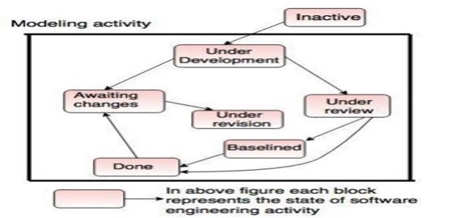

# Contents

-   [Contents](#contents)
-   [Software Development Life Cycle (SDLC)](#software-development-life-cycle-sdlc)
-   [Process Models](#process-models)
    -   [The Waterfall Model](#the-waterfall-model)
    -   [Evolutionary Process Models](#evolutionary-process-models)
        -   [Prototyping Model](#prototyping-model)
            -   [Advantages](#advantages)
            -   [Disadvantages](#disadvantages)
        -   [Spiral Model](#spiral-model)
            -   [Advantages](#advantages-1)
            -   [Disadvantages](#disadvantages-1)
        -   [Incremental Models](#incremental-models)
            -   [Advantages](#advantages-2)
            -   [Disadvantages](#disadvantages-2)
        -   [Concurrent Development Model](#concurrent-development-model)
            -   [Advantages](#advantages-3)
            -   [Disadvantages](#disadvantages-3)
    -   [Agile Software Development](#agile-software-development)
        -   [Agile Process Models : Scrum](#agile-process-models--scrum)
        -   [Agile Proces models : Adaptive Software Development (ASD)](#agile-proces-models--adaptive-software-development-asd)
        -   [Agile Process Models : Extreme Programming (XP)](#agile-process-models--extreme-programming-xp)

# Software Development Life Cycle (SDLC)

The **software development lifecycle (SDLC)** is the cost-effective and time-efficient process that development teams use to design and build high-quality software.
The goal of SDLC is to minimize project risks through forward planning so that software meets customer expectations during production and beyond. This methodology outlines a series of steps that divide the software development process into tasks you can assign, complete, and measure.

Development of any software comes up with a life cycle of certain steps called **Software Development Life Cycle** which are executed in a cyclic manner. The steps are:

-   Requirement Gathering
-   Planning
-   Designing
-   Development
-   Testing
-   Deploy and Maintain
    

# Process Models

A software process model is an abstraction of the software development process. The models specify the stages and order of a process. So, think of this as a representation of the order of activities of the process and the sequence in which they are performed.

A model will define the following properties:

-   The tasks to be performed
-   The input and output of each task
-   The pre and post conditions for each task
-   The flow and sequence of each task

## The Waterfall Model

-   The waterfall model is the basic software development life cycle model.
-   It is very simple but idealistic.
-   The classical waterfall model divides the life cycle into a set of phases.
-   **This model considers that one phase can be started after the completion of the previous phase.**
-   **That is the output of one phase will be the input to the next phase.** Thus the development process can be considered as a **sequential flow** in the waterfall model. 
    

## Evolutionary Process Models

Evolutionary models are **iterative type models**. They allow to develop more complete versions of the software.

There are three types of evolutionary models:

-   The prototyping model
-   The spiral model
-   Concurrent development model

### Prototyping Model

The Prototyping Model is one of the most popularly used Software Development Life Cycle Models (SDLC models). This model is used when the customers do not know the exact project requirements beforehand. In this model, a prototype of the end product is first developed, tested and refined as per customer feedback repeatedly till a final acceptable prototype is achieved which forms the basis for developing the final product.

-   Prototype is defined as first or preliminary form using which other forms are copied or derived. Prototype model is a set of general objectives for software.
-   It does not identify the requirements like detailed input, output.
-   It is software working model of limited functionality. The process of prototype model has been shown below. 
    

#### Advantages

-   The development process is the best platform to understand the system by the user.
-   Errors are detected much earlier.
-   Gives quick user feedback for better solutions.

#### Disadvantages

-   It is a slow process because it takes more time for development.
-   Many changes can disturb the rhythm of the development team.
-   It is a thrown away prototype when the users are confused with it.

### Spiral Model

Spiral model is one of the most important Software Development Life Cycle models, which provides support for **Risk Handling.**

-   Spiral model is a risk driven process model.
-   It is used for generating the software projects.
-   In spiral model, an alternate solution is provided if the risk is found in the risk analysis, then alternate solutions are suggested and implemented.
-   It is a combination of prototype and sequential model or waterfall model.
-   In one iteration all activities are done, for large project's the output is small.
-   The initial phase of the spiral model in the early stages of Waterfall Life Cycle that is needed to develop a software product.
-   The exact number of phases needed to develop the product can be varied by the project manager depending upon the project risks.
-   As the project manager dynamically determines the number of phases, so the project manager has an important role to develop a product using a spiral model.
-   The framework activities of the spiral model are as shown in the following figure given below. 
    

#### Advantages

-   It reduces high amount of risk.
-   It is good for large and critical projects.
-   It gives strong approval and documentation control.
-   In spiral model, the software is produced early in the life cycle process.

#### Disadvantages

-   It can be costly to develop a software model.
-   It is not used for small projects.

### Incremental Models

The incremental process model is also known as the **Successive version model.**

-   The incremental model divides the system’s functionality into small increments that are delivered one after the other in quick succession.
-   The most important functionality is implemented in the initial increments.
-   The subsequent increments expand on the previous ones until everything has been updated and implemented.
-   Incremental development is based on developing an initial implementation, exposing it to user feedback, and evolving it through new versions.
-   The process’ activities are interwoven by feedback.
-   Each iteration passes through the requirements, design, coding, and testing stages. The activities of incremental models has been shown in below figure. 
    

#### Advantages

-   The software will be generated quickly during the software life cycle.
-   Throughout the development stages changes can be done.
-   Errors are easy to be identified.
-   A customer can respond to each building.

#### Disadvantages

-   Problems might cause due to system architecture as such not all requirements collected up front for the entire software lifecycle.
-   Rectifying a problem in one unit requires correction in all the units and consumes a lot of time.

### Concurrent Development Model

Concurrent models are those models within which the various activities of software development happen at the same time, for faster development and a better outcome. The concurrent model is also referred to as a **parallel working model.**

-   The communication activity has completed in the first iteration and exits in the awaiting changes state.
-   The modeling activity completed its initial communication and then go to the underdevelopment state. The process of concurrent development model have been shown in below figure. 
    

#### Advantages

-   It is easy for understanding and use.
-   It gives immediate feedback from testing.
-   It provides an accurate picture of the current state of a project.

#### Disadvantages

-   It needs better communication between the team members. This may not be achieved all the time.
-   It requires to remember the status of the different activities.

## Agile Software Development

-   The Agile software development methodology is one of the simplest and effective processes to turn a vision for a business need into software solutions.
-   Agile is a term used to describe software development approaches that employ continual planning, learning, improvement, team collaboration, evolutionary development, and early delivery.
-   Also, it encourages flexible responses to change.
-   Larger organizations use agile scaling to extend agile processes and team structure to multiple teams, for example in the form of the Safe or Less framework.
    Agile was invented in the software industry but nowadays businesses in all industry sectors make use of it.
-   **Agility** is the ability of a business as a whole to respond quickly to changes, especially external changes. For example, by adapting business processes or changing customer experiences.
-   **Agility** is a crucial factor for businesses that are in a Digital Transformations. There are many ways to achieve agility, including digital technologies, innovative product design, process agility, and culture shifting .
-   The **agile process models** have been shown in below figure:
     
    

### Agile Process Models : Scrum

-   **SCRUM** is an agile development method which concentrates specifically on how to manage tasks within a team-based development environment.
-   Basically, Scrum is derived from activity that occurs during a rugby match.
-   Agile and Scrum consist of three roles, and their responsibilities are explained as follows:
    -   **Scrum Master**
        -   **Scrum master** is responsible for setting up the team, sprint meeting and removes obstacles to progress
    -   **Product owner**
        -   The **Product Owner** creates product backlog, prioritizes the backlog and is responsible for the delivery of the functionality at each iteration
    -   **Scrum Team** - Team manages its own work and organizes the work to complete the sprint or cycle 
        

### Agile Proces models : Adaptive Software Development (ASD)

-   **Adaptive Software Development** is a method to build complex software and system.
-   ASD focuses on human collaboration and self-organization. ASD “**life cycle**” incorporates three phases namely:
    -   Speculation
    -   Collaboration
    -   Learning

### Agile Process Models : Extreme Programming (XP)

**Extreme Programming** technique is very helpful when there is constantly changing demands or requirements from the customers or when they are not sure about the functionality of the system. The process of XP have been shown in below figure. 

There are 6 phases available in Agile XP method which are as follow as:

-   Planning
-   Analysis
-   Design
-   Execution
-   Wrapping
-   Closure
