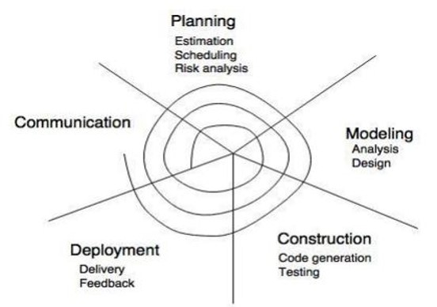
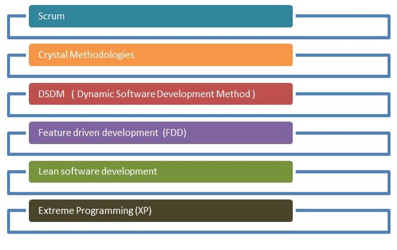

# Contents

-   [Contents](#contents)
-   [Software Development Life Cycle (SDLC)](#software-development-life-cycle-sdlc)
    -   [Communication](#communication)
    -   [Requirement Gathering](#requirement-gathering)
    -   [Feasibility Study](#feasibility-study)
    -   [System Analysis](#system-analysis)
    -   [Software Design](#software-design)
    -   [Coding](#coding)
    -   [Testing](#testing)
    -   [Integration](#integration)
    -   [Implementation](#implementation)
    -   [Operation and Maintenance](#operation-and-maintenance)
    -   [Disposition](#disposition)
-   [Software Development Paradigm - The Process Models](#software-development-paradigm---the-process-models)
    -   [The Waterfall Model](#the-waterfall-model)
    -   [Iterative Model](#iterative-model)
    -   [Spiral Model](#spiral-model)
    -   [Evolutionary Process Models](#evolutionary-process-models)
        -   [Prototyping Model](#prototyping-model)
            -   [Advantages](#advantages)
            -   [Disadvantages](#disadvantages)
        -   [Spiral Model](#spiral-model-1)
            -   [Advantages](#advantages-1)
            -   [Disadvantages](#disadvantages-1)
        -   [Incremental Models](#incremental-models)
            -   [Advantages](#advantages-2)
            -   [Disadvantages](#disadvantages-2)
        -   [Concurrent Development Model](#concurrent-development-model)
            -   [Advantages](#advantages-3)
            -   [Disadvantages](#disadvantages-3)
-   [Agile Software Development](#agile-software-development)
    -   [Phases of Agile Model:](#phases-of-agile-model)
    -   [Agile Porcess Methodlogies](#agile-porcess-methodlogies)
        -   [Scrum](#scrum)
        -   [Adaptive Software Development (ASD)](#adaptive-software-development-asd)
        -   [Extreme Programming (XP)](#extreme-programming-xp)
    -   [When to use the Agile Model?](#when-to-use-the-agile-model)
    -   [Advantage(Pros) of Agile Method:](#advantagepros-of-agile-method)
    -   [Disadvantages(Cons) of Agile Model:](#disadvantagescons-of-agile-model)

# Software Development Life Cycle (SDLC)

The **software development lifecycle (SDLC)** is the cost-effective and time-efficient process that development teams use to design and build high-quality software.
The goal of SDLC is to minimize project risks through forward planning so that software meets customer expectations during production and beyond. This methodology outlines a series of steps that divide the software development process into tasks you can assign, complete, and measure.

**SDLC** provides a series of steps to be followed to design and develop a software product efficiently. SDLC framework includes the following steps: 

## Communication

This is the first step where the user initiates the request for a desired software product. He contacts the service provider and tries to negotiate the terms. He submits his request to the service providing organization in writing.

## Requirement Gathering

This step onwards the software development team works to carry on the project. The team holds discussions with various stakeholders from problem domain and tries to bring out as much information as possible on their requirements. The requirements are contemplated and segregated into **user requirements**, **system requirements** and **functional requirements.** The requirements are collected using a number of practices as given -

-   studying the existing or obsolete system and software,
-   conducting interviews of users and developers,
-   referring to the database or
-   collecting answers from the questionnaires.

## Feasibility Study

After requirement gathering, the team comes up with a rough plan of software process. At this step the team analyzes if a software can be made to fulfill all requirements of the user and if there is any possibility of software being no more useful. It is found out, if the project is financially, practically and technologically feasible for the organization to take up. There are many algorithms available, which help the developers to conclude the feasibility of a software project.

## System Analysis

At this step the developers decide a roadmap of their plan and try to bring up the best software model suitable for the project. System analysis includes Understanding of software product limitations, learning system related problems or changes to be done in existing systems beforehand, identifying and addressing the impact of project on organization and personnel etc. The project team analyzes the scope of the project and plans the schedule and resources accordingly.

## Software Design

Next step is to bring down whole knowledge of requirements and analysis on the desk and design the software product. The inputs from users and information gathered in requirement gathering phase are the inputs of this step. The output of this step comes in the form of two designs; **logical design** and **physical design.** Engineers produce **meta-data and data dictionaries**, **logical diagrams**, **data-flow** diagrams and in some cases **pseudo codes.**

## Coding

This step is also known as programming phase. The implementation of software design starts in terms of writing program code in the suitable programming language and developing error-free executable programs efficiently.

## Testing

An estimate says that 50% of whole software development process should be tested. Errors may ruin the software from critical level to its own removal. Software testing is done while coding by the developers and thorough testing is conducted by testing experts at various levels of code such as module testing, program testing, product testing, in-house testing and testing the product at user’s end. Early discovery of errors and their remedy is the key to reliable software.

## Integration

Software may need to be integrated with the libraries, databases and other program(s). This stage of SDLC is involved in the integration of software with outer world entities.

## Implementation

This means installing the software on user machines. At times, software needs post-installation configurations at user end. Software is tested for portability and adaptability and integration related issues are solved during implementation.

## Operation and Maintenance

This phase confirms the software operation in terms of more efficiency and less errors. If required, the users are trained on, or aided with the documentation on how to operate the software and how to keep the software operational. The software is maintained timely by updating the code according to the changes taking place in user end environment or technology. This phase may face challenges from hidden bugs and real-world unidentified problems.

## Disposition

As time elapses, the software may decline on the performance front. It may go completely obsolete or may need intense upgradation. Hence a pressing need to eliminate a major portion of the system arises. This phase includes archiving data and required software components, closing down the system, planning disposition activity and terminating system at appropriate end-of-system time.

# Software Development Paradigm - The Process Models

The software development paradigm helps developer to select a strategy to develop the software. 
A software development paradigm has its own set of tools, methods and procedures, which are expressed clearly and defines software development life cycle.

A software process model is an abstraction of the software development process. The models specify the stages and order of a process. So, think of this as a representation of the order of activities of the process and the sequence in which they are performed.

A model will define the following properties:

-   The tasks to be performed
-   The input and output of each task
-   The pre and post conditions for each task
-   The flow and sequence of each task

A few of software development paradigms or process models are defined as follows:

## The Waterfall Model

Waterfall model is the simplest model of software development paradigm. It says the all the phases of SDLC will function one after another in linear manner. That is, when the first phase is finished then only the second phase will start and so on.

-   The waterfall model is the basic software development life cycle model.
-   It is very simple but idealistic.
-   The classical waterfall model divides the life cycle into a set of phases.
-   **This model considers that one phase can be started after the completion of the previous phase.**
-   **That is the output of one phase will be the input to the next phase.** Thus the development process can be considered as a **sequential flow** in the waterfall model. 
    

This model assumes that everything is carried out and taken place perfectly as planned in the previous stage and there is no need to think about the past issues that may arise in the next phase. This model does not work smoothly if there are some issues left at the previous step. The sequential nature of model does not allow us go back and undo or redo our actions.

This model is best suited when developers already have designed and developed similar software in the past and are aware of all its domains

## Iterative Model

This model leads the software development process in iterations. It projects the process of development in cyclic manner repeating every step after every cycle of SDLC process.

The software is first developed on very small scale and all the steps are followed which are taken into consideration. Then, on every next iteration, more features and modules are designed, coded, tested and added to the software. Every cycle produces a software, which is complete in itself and has more features and capabilities than that of the previous one.
After each iteration, the management team can do work on risk management and prepare for the next iteration. Because a cycle includes small portion of whole software process, it is easier to manage the development process but it consumes more resources.

## Spiral Model

Spiral model is a combination of both, iterative model and one of the SDLC model. It can be seen as if you choose one SDLC model and combine it with cyclic process (iterative model).

This model considers risk, which often goes un-noticed by most other models. The model starts with determining objectives and constraints of the software at the start of one iteration. Next phase is of prototyping the software. This includes risk analysis. Then one standard SDLC model is used to build the software. In the fourth phase of the plan of next iteration is prepared

## Evolutionary Process Models

-   Evolutionary models are **iterative type models.**
-   They allow to develop more complete versions of the software.

**Following are the evolutionary process models.**

-   The prototyping model
-   The spiral model
-   Concurrent development model

### Prototyping Model

The Prototyping Model is one of the most popularly used Software Development Life Cycle Models (SDLC models). This model is used when the customers do not know the exact project requirements beforehand. In this model, a prototype of the end product is first developed, tested and refined as per customer feedback repeatedly till a final acceptable prototype is achieved which forms the basis for developing the final product.

-   Prototype is defined as first or preliminary form using which other forms are copied or derived. Prototype model is a set of general objectives for software.
-   It does not identify the requirements like detailed input, output.
-   It is software working model of limited functionality. The process of prototype model has been shown below. 
    

#### Advantages

-   Prototype model need not know the detailed input, output, processes, adaptability of operating system and full machine interaction.
-   The development process is the best platform to understand the system by the user.
-   Errors are detected much earlier.
-   Gives quick user feedback for better solutions.

#### Disadvantages

-   The client involvement is more and it is not always considered by the developer.
-   It is a slow process because it takes more time for development.
-   Many changes can disturb the rhythm of the development team.
-   It is a thrown away prototype when the users are confused with it.

### Spiral Model

Spiral model is one of the most important Software Development Life Cycle models, which provides support for **Risk Handling.**

-   Spiral model is a risk driven process model.
-   It is used for generating the software projects.
-   In spiral model, an alternate solution is provided if the risk is found in the risk analysis, then alternate solutions are suggested and implemented.
-   It is a combination of prototype and sequential model or waterfall model.
-   In one iteration all activities are done, for large project's the output is small.
-   The initial phase of the spiral model in the early stages of Waterfall Life Cycle that is needed to develop a software product.
-   The exact number of phases needed to develop the product can be varied by the project manager depending upon the project risks.
-   As the project manager dynamically determines the number of phases, so the project manager has an important role to develop a product using a spiral model.
-   The framework activities of the spiral model are as shown in the following figure given below. 
    

#### Advantages

-   It reduces high amount of risk.
-   It is good for large and critical projects.
-   It gives strong approval and documentation control.
-   In spiral model, the software is produced early in the life cycle process.

#### Disadvantages

-   It can be costly to develop a software model.
-   It is not used for small projects.

### Incremental Models

The incremental process model is also known as the **Successive version model.**

-   The incremental model divides the system’s functionality into small increments that are delivered one after the other in quick succession.
-   The most important functionality is implemented in the initial increments.
-   The subsequent increments expand on the previous ones until everything has been updated and implemented.
-   Incremental development is based on developing an initial implementation, exposing it to user feedback, and evolving it through new versions.
-   The process’ activities are interwoven by feedback.
-   Each iteration passes through the requirements, design, coding, and testing stages. The activities of incremental models has been shown in below figure. 
    

#### Advantages

-   The software will be generated quickly during the software life cycle.
-   Throughout the development stages changes can be done.
-   Errors are easy to be identified.
-   A customer can respond to each building.

#### Disadvantages

-   Problems might cause due to system architecture as such not all requirements collected up front for the entire software lifecycle.
-   Rectifying a problem in one unit requires correction in all the units and consumes a lot of time.

### Concurrent Development Model

Concurrent models are those models within which the various activities of software development happen at the same time, for faster development and a better outcome. The concurrent model is also referred to as a **parallel working model.**

-   The communication activity has completed in the first iteration and exits in the awaiting changes state.
-   The modeling activity completed its initial communication and then go to the underdevelopment state. The process of concurrent development model have been shown in below figure. 
    

#### Advantages

-   It is easy for understanding and use.
-   It gives immediate feedback from testing.
-   It provides an accurate picture of the current state of a project.

#### Disadvantages

-   It needs better communication between the team members. This may not be achieved all the time.
-   It requires to remember the status of the different activities.

# Agile Software Development

-   The meaning of **Agile** is **swift** or **versatile**.
-   “**Agile process model**" refers to a software development approach based on **iterative development**.
-   Agile methods break tasks into smaller iterations, or parts do not directly involve long term planning.
-   The project scope and requirements are laid down at the beginning of the development process. Plans regarding the number of iterations, the duration and the scope of each iteration are clearly defined in advance.
     
-   Each iteration is considered as a short time "**frame**" in the Agile process model, which typically lasts from **one to four weeks.**
-   The division of the entire project into smaller parts helps to minimize the project risk and to reduce the overall project delivery time requirements.
-   Each iteration involves a team working through a full software development life cycle including planning, requirements analysis, design, coding, and testing before a working product is demonstrated to the client. 
    

## Phases of Agile Model:

Following are the phases in the Agile model are as follows:

1. **Requirements gathering :** In this phase, you must define the requirements. You should explain business opportunities and plan the time and effort needed to build the project. Based on this information, you can evaluate technical and economic feasibility.
2. **Design the requirements :** When you have identified the project, work with stakeholders to define requirements. You can use the user flow diagram or the high-level UML diagram to show the work of new features and show how it will apply to your existing system.
3. **Construction/ iteration :** When the team defines the requirements, the work begins. Designers and developers start working on their project, which aims to deploy a working product. The product will undergo various stages of improvement, so it includes simple, minimal functionality.
4. **Testing/ Quality assurance :** In this phase, the Quality Assurance team examines the product's performance and looks for the bug.
5. **Deployment :** In this phase, the team issues a product for the user's work environment.
6. **Feedback :** After releasing the product, the last step is feedback. In this, the team receives feedback about the product and works through the feedback.

## Agile Porcess Methodlogies

### Scrum

**SCRUM** is an agile development process focused primarily on **ways to manage tasks in team-based development conditions.**

There are three roles in it, and their responsibilities are:

-   **Scrum Master :** The scrum can set up the master team, arrange the meeting and remove obstacles for the process.
-   **Product owner :** The product owner makes the product backlog, prioritizes the delay and is responsible for the distribution of functionality on each repetition.
-   **Scrum Team :** The team manages its work and organizes the work to complete the sprint or cycle. 
    

### Adaptive Software Development (ASD)

-   **Adaptive Software Development** is a method to build complex software and system.
-   ASD focuses on human collaboration and self-organization. ASD “**life cycle**” incorporates three phases namely:
    -   Speculation
    -   Collaboration
    -   Learning 
        

### Extreme Programming (XP)

**Extreme Programming** technique is very helpful when there is constantly changing demands or requirements from the customers or when they are not sure about the functionality of the system. The process of XP have been shown in below figure. 

There are 6 phases available in Agile XP method which are as follow as:

-   Planning
-   Analysis
-   Design
-   Execution
-   Wrapping
-   Closure

## When to use the Agile Model?

-   When frequent changes are required.
-   When a highly qualified and experienced team is available.
-   When a customer is ready to have a meeting with a software team all the time.
-   When project size is small.

## Advantage(Pros) of Agile Method:

-   Frequent Delivery
-   Face-to-Face Communication with clients.
-   Efficient design and fulfils the business requirement.
-   Anytime changes are acceptable.
-   It reduces total development time.

## Disadvantages(Cons) of Agile Model:

-   Due to the shortage of formal documents, it creates confusion and crucial decisions taken throughout various phases can be misinterpreted at any time by different team members.
-   Due to the lack of proper documentation, once the project completes and the developers allotted to another project, maintenance of the finished project can become a difficulty.
