# Contents

-   [Contents](#contents)
-   [Unified Modeling Language](#unified-modeling-language)
    -   [Goals of UML](#goals-of-uml)
    -   [Characteristics of UML](#characteristics-of-uml)
    -   [UML-Building Blocks](#uml-building-blocks)
        -   [Things](#things)
            -   [Structural things](#structural-things)
            -   [Behavioral Things](#behavioral-things)
            -   [Grouping Things](#grouping-things)
            -   [Annotation Things](#annotation-things)
        -   [Relationships](#relationships)
        -   [Diagrams](#diagrams)
    -   [UML- Architecture](#uml--architecture)
        -   [Use case view](#use-case-view)
        -   [Design View](#design-view)
        -   [Implementation View](#implementation-view)
        -   [Process View](#process-view)
        -   [Deployment View](#deployment-view)

# Unified Modeling Language

**UML (Unified Modeling Language)** is a general-purpose, graphical modeling language in the field of Software Engineering. UML is used to specify, visualize, construct, and document the artifacts (major elements) of the software system. It was initially developed by Grady Booch, Ivar Jacobson, and James Rumbaugh in 1994-95 at Rational software, and its further development was carried out through 1996. In 1997, it got adopted as a standard by the Object Management Group.

## Goals of UML

-   Since it is a general-purpose modeling language, it can be utilized by all the modelers.
-   UML came into existence after the introduction of object-oriented concepts to systemize and consolidate the object-oriented development, due to the absence of standard methods at that time.
-   The UML diagrams are made for business users, developers, ordinary people, or anyone who is looking forward to understand the system, such that the system can be software or non-software.
-   Thus it can be concluded that the UML is a simple modelling approach that is used to model all the practical systems.

## Characteristics of UML

The UML has the following features:

-   It is a generalized modeling language.
-   It is distinct from other programming languages like C++, Python, etc.
-   It is interrelated to object-oriented analysis and design.
-   It is used to visualize the workflow of the system.
-   It is a pictorial language, used to generate powerful modelling artifacts.

## UML-Building Blocks

UML is composed of three main building blocks, i.e., **things**, **relationships**, and **diagrams**. Building blocks generate one complete UML model diagram by rotating around several different blocks. It plays an essential role in developing UML diagrams. The basic UML building blocks are enlisted below:

1. Things
2. Relationships
3. Diagrams

### Things

Anything that is a real world entity or object is termed as things. It can be divided into several different categories:

-   Structural things
-   Behavioural things
-   Grouping things
-   An notational things

#### Structural things

**Nouns** that depicts the static behaviour of a model is termed as structural things.

-   They display the physical and conceptual components. They include **class**, **object**, **interface**, **node**, **collaboration**, **component**, and a **use case.**
-   **Class :** A Class is a set of identical things that outlines the functionality and properties of an object. It also represents the abstract class whose functionalities are not defined.
    Its notation is as follows; 
    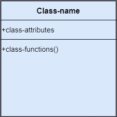
-   **Object :** An individual that describes the behavior and the functions of a system. The notation of the object is similar to that of the class; the only difference is that the object name is always underlined and its notation is given below; 
    
-   **Interface :** A set of operations that describes the functionality of a class, which is implemented whenever an interface is implemented. 
    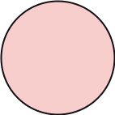
-   **Collaboration :** It represents the interaction between things that is done to meet the goal. It is symbolized as a dotted ellipse with its name written inside it. 
    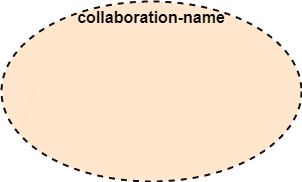
-   **Use case :** Use case is the core concept of object-oriented modeling. It portrays a set of actions executed by a system to achieve the goal. 
    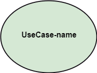
-   **Actor :** It comes under the use case diagrams. It is an object that interacts with the system, for example, a user. 
    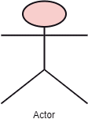
-   **Component :** It represents the physical part of the system. 
    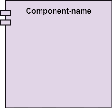
-   **Node :** A physical element that exists at run time. 
    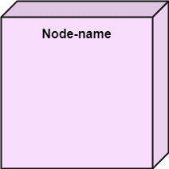

#### Behavioral Things

They are the **verbs** that encompass the dynamic parts of a model. It depicts the behavior of a system. They involve **state machine**, **activity diagram**, **interaction diagram**, **grouping things**, **annotation things**

-   **State Machine :** It defines a sequence of states that an entity goes through in the software development lifecycle. It keeps a record of several distinct states of a system component. 
    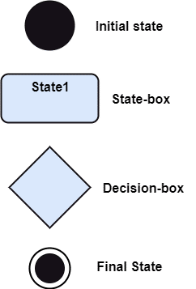
-   **Activity Diagram :** It portrays all the activities accomplished by different entities of a system. It is represented the same as that of a state machine diagram. It consists of an initial state, final state, a decision box, and an action notation. 
    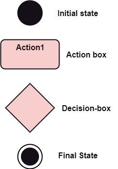
-   **Interaction Diagram :** It is used to envision the flow of messages between several components in a system. 
    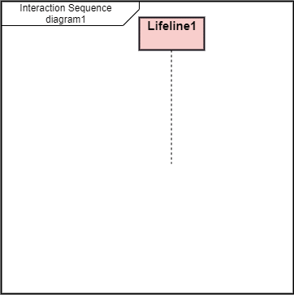

#### Grouping Things

It is a method that together binds the elements of the UML model. In UML, the **package** is the only thing, which is used for grouping.

-   **Package :** Package is the only thing that is available for grouping behavioral and structural things. 
    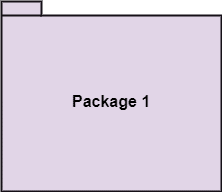

#### Annotation Things

It is a mechanism that captures the remarks, descriptions, and comments of UML model elements. In UML, a **note** is the only Annotational thing.

-   **Note :** It is used to attach the constraints, comments, and rules to the elements of the model. It is a kind of yellow sticky note. 
    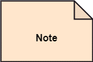

### Relationships

It illustrates the meaningful connections between things. It shows the association between the entities and defines the functionality of an application. There are four types of relationships given below:

-   **Dependency :** Dependency is a kind of relationship in which a change in target element affects the source element, or simply we can say the source element is dependent on the target element. It is one of the most important notations in UML. It depicts the dependency from one entity to another. 
    It is denoted by a dotted line followed by an arrow at one side as shown below, 
    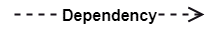
     
-   **Association :** A set of links that associates the entities to the UML model. It tells how many elements are actually taking part in forming that relationship.
    It is denoted by a dotted line with arrowheads on both sides to describe the relationship with the element on both sides. 
    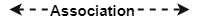
     
-   **Generalization :** It portrays the relationship between a general thing (a parent class or superclass) and a specific kind of that thing (a child class or subclass). It is used to describe the concept of inheritance.
    It is denoted by a straight line followed by an empty arrowhead at one side. 
    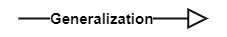
     
-   **Realization :** It is a semantic kind of relationship between two things, where one defines the behavior to be carried out, and the other one implements the mentioned behavior. It exists in interfaces.
    It is denoted by a dotted line with an empty arrowhead at one side. 
    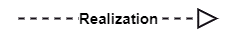

### Diagrams

The **diagrams** are the graphical implementation of the models that incorporate symbols and text. Each symbol has a different meaning in the context of the UML diagram. There are thirteen different types of UML diagrams that are available in UML 2.0, such that each diagram has its own set of a symbol. And each diagram manifests a different dimension, perspective, and view of the system.

UML diagrams are classified into three categories that are given below:

1. Structural Diagram
2. Behavioral Diagram
3. Interaction Diagram
    

-   **Structural Diagram :** It represents the **static view** of a system by portraying the structure of a system. It shows several objects residing in the system. Following are the structural diagrams given below:
    -   Class diagram
    -   Object diagram
    -   Package diagram
    -   Component diagram
    -   Deployment diagram
-   **Behavioral Diagram :** It depicts the behavioral features of a system. It deals with dynamic parts of the system. It encompasses the following diagrams:
    -   Activity diagram
    -   State machine diagram
    -   Use case diagram
-   **Interaction diagram :** It is a subset of behavioral diagrams. It depicts the interaction between two objects and the data flow between them. Following are the several interaction diagrams in UML:
    -   Timing diagram
    -   Sequence diagram
    -   Collaboration diagram

The UML diagrams are categorized into **structural diagrams**, **behavioural diagrams**, and also **interaction overview diagrams**. The diagrams are hierarchically classified in the following figure:
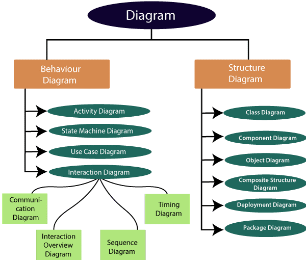

## UML- Architecture

Software architecture is all about how a software system is built at its highest level. It is needed to think big from multiple perspectives with quality and design in mind. The software team is tied to many practical concerns, such as:

-   The structure of the development team.
-   The needs of the business.
-   Development cycle.
-   The intent of the structure itself.

Software architecture provides a basic design of a complete software system. It defines the elements included in the system, the functions each element has, and how each element relates to one another. In short, it is a big picture or overall structure of the whole system, how everything works together.

To form an architecture, the software architect will take several factors into consideration:

-   What will the system be used for?
-   Who will be using the system?
-   What quality matters to them?
-   Where will the system run?

The architect plans the structure of the system to meet the needs like these. It is essential to have proper software architecture, mainly for a large software system. Having a clear design of a complete system as a starting point provides a solid basis for developers to follow.

Each developer will know what needs to be implemented and how things relate to meet the desired needs efficiently. One of the main advantages of software architecture is that it provides high productivity to the software team. The software development becomes more effective as it comes up with an explained structure in place to coordinate work, implement individual features, or ground discussions on potential issues. With a lucid architecture, it is easier to know where the key responsibilities are residing in the system and where to make changes to add new requirements or simply fixing the failures.

In addition, a clear architecture will help to achieve quality in the software with a well-designed structure using principles like separation of concerns; the system becomes easier to maintain, reuse, and adapt. The software architecture is useful to people such as software developers, the project manager, the client, and the end-user. Each one will have different perspectives to view the system and will bring different agendas to a project. Also, it provides a collection of several views. It can be best understood as a collection of five views:

1. Use case view
2. Design view
3. Implementation view
4. Process view
5. Development view

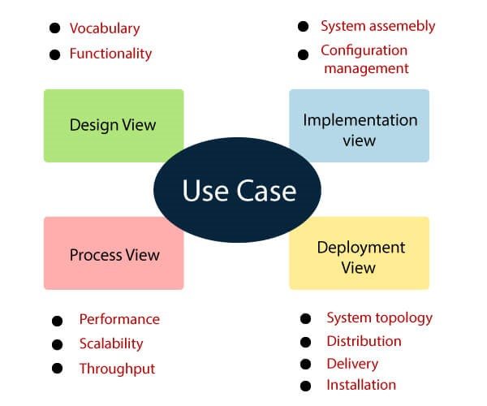

### Use case view

-   It is a view that shows the functionality of the system as perceived by external actors.
-   It reveals the requirements of the system.
-   With UML, it is easy to capture the static aspects of this view in the use case diagrams, whereas its dynamic aspects are captured in interaction diagrams, state chart diagrams, and activity diagrams.

### Design View

-   It is a view that shows how the functionality is designed inside the system in terms of static structure and dynamic behavior.
-   It captures the vocabulary of the problem space and solution space.
-   With UML, it represents the static aspects of this view in class and object diagrams, whereas its dynamic aspects are captured in interaction diagrams, state chart diagrams, and activity diagrams.

### Implementation View

-             It is the view that represents the organization of the core components and files.
-   It primarily addresses the configuration management of the systems releases.
-   With UML, its static aspects are expressed in component diagrams, and the dynamic aspects are captured in interaction diagrams, state chart diagrams, and activity diagrams.

### Process View

-   It is the view that demonstrates the concurrency of the system.
-   It incorporates the threads and processes that make concurrent system and synchronized mechanisms.
-   It primarily addresses the system's scalability, throughput, and performance.
-   Its static and dynamic aspects are expressed the same way as the design view but focus more on the active classes that represent these threads and processes.

### Deployment View

-   It is the view that shows the deployment of the system in terms of physical architecture.
-   It includes the nodes, which form the system hardware topology where the system will be executed.
-   It primarily addresses the distribution, delivery, and installation of the parts that build the physical system.
