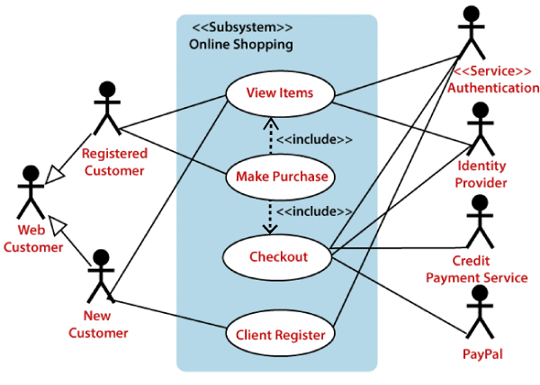
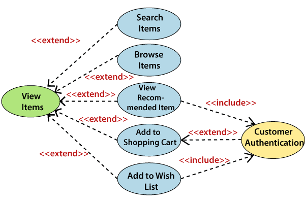
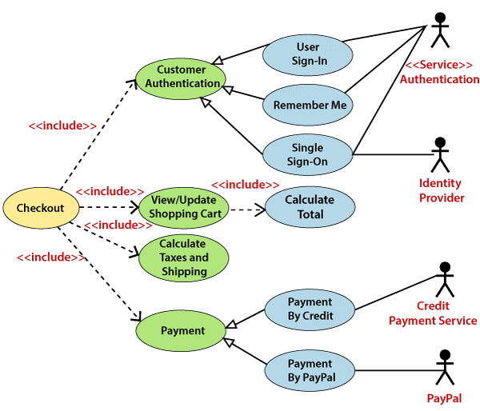

# Contents

-   [Contents](#contents)
-   [UML Use Case Diagram](#uml-use-case-diagram)
    -   [Purpose of Use Case Diagrams](#purpose-of-use-case-diagrams)
    -   [Example of a Use Case Diagram](#example-of-a-use-case-diagram)

# UML Use Case Diagram

A use case diagram is used to represent the dynamic behavior of a system. It encapsulates the system's functionality by incorporating use cases, actors, and their relationships. It models the tasks, services, and functions required by a system/subsystem of an application. It depicts the high-level functionality of a system and also tells how the user handles a system.

## Purpose of Use Case Diagrams

The main purpose of a use case diagram is to portray the dynamic aspect of a system. It accumulates the system's requirement, which includes both internal as well as external influences. It invokes persons, use cases, and several things that invoke the actors and elements accountable for the implementation of use case diagrams. It represents how an entity from the external environment can interact with a part of the system.

Following are the purposes of a use case diagram given below:

1. It gathers the system's needs.
2. It depicts the external view of the system.
3. It recognizes the internal as well as external factors that influence the system.
4. It represents the interaction between the actors.

## Example of a Use Case Diagram

A use case diagram depicting the Online Shopping website is given below.

Here the Web Customer actor makes use of any online shopping website to purchase online. The top-level uses are as follows; View Items, Make Purchase, Checkout, Client Register. The **View Items** use case is utilized by the customer who searches and view products. The **Client Register** use case allows the customer to register itself with the website for availing gift vouchers, coupons, or getting a private sale invitation. It is to be noted that the **Checkout** is an included use case, which is part of **Making Purchase**, and it is not available by itself.
 

 

The **View Items** is further extended by several use cases such as; Search Items, Browse Items, View Recommended Items, Add to Shopping Cart, Add to Wish list. All of these extended use cases provide some functions to customers, which allows them to search for an item. All of these extended use cases provide some functions to customers, which allows them to search for an item.

Both **View Recommended Item** and **Add to Wish List** include the Customer Authentication use case, as they necessitate authenticated customers, and simultaneously item can be added to the shopping cart without any user authentication. 

Similarly, the **Checkout** use case also includes the following use cases, as shown below. It requires an authenticated Web Customer, which can be done by login page, user authentication cookie ("Remember me"), or Single Sign-On (SSO). SSO needs an external identity provider's participation, while Web site authentication service is utilized in all these use cases.

The **Checkout** use case involves Payment use case that can be done either by the credit card and external credit payment services or with PayPal.

