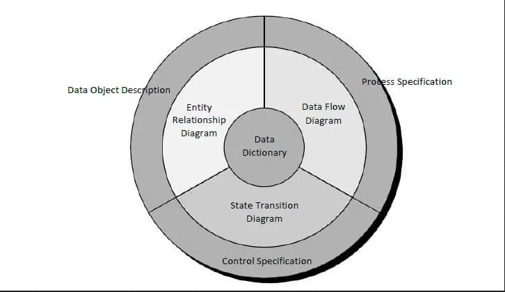

# Contents

-   [Contents](#contents)
-   [Building analysis model](#building-analysis-model)
    -   [Requirements analysis](#requirements-analysis)
    -   [Database Data Modelling \& Design Options](#database-data-modelling--design-options)
    -   [Flow oriented modelling](#flow-oriented-modelling)

# Building analysis model

At a technical level, **software engineering** begins with a series of modeling tasks that lead to a complete specification of requirements and a comprehensive design representation for the software to be built.

The first technical representation of a system which is the analysis model, actually a set of models. There have been many methods proposed for analysis modeling.

The **structured analysis** (a classical modeling method) and **object-oriented analysis** are two main methods for analysis modeling.

**Structured analysis** is a model building activity. The analysis model must achieve three primary objectives:

1. to describe what the customer requires
2. to establish a basis for the development of software design
3. to define a set of requirements that can be validated once the software is developed.  
   

The **data dictionary** is a repository that contains descriptions of all data objects consumed or produced by the software.

The **entity relation diagram (ERD)** represent the relationships between data objects. The entity relation diagram is the notation that is **used to conduct the data modeling activity**. The attributes of each data object noted in the entity relation diagram (ERD) can be described using a **data object description.**

The **data flow diagram (DFD)** serves two purposes: **(1)** to provide an indication of how data are transformed as they move through the system, **(2)** to depict the functions (and sub-functions) that transform the data flow. The description of each function presented in the DFD is contained in a **process specification.** **The DFD serves as a basis for the function modeling.**

The **state transition diagram (STD)** indicates how the system function/behave as a consequence of external events. To achieve this, the STD represents the various modes of behavior (called states) of the system and the manner in which transitions are made from state to state. **The STD serves as the basis for behavioral modeling.** The information about the control aspects of the software is contained in the **control specification.**

## Requirements analysis

-   specifies software’s operational characteristics
-   indicates software's indicates software's interface with other system with elements
-   Establishes constraints that software must meet that software must meet.
-   Data modelling is the process used to structure how data is stored, as well as modelling relationships within the data.

## Database Data Modelling & Design Options

-   **Relational Databases (Entity models) :** These are made from tables (tabular data) with solutions including SQL.
-   **Object Databases (NoSQL) :** These are made up of key, value pairs and don’t have a strict schema, several solutions include MongoDB.
-   **Graph Databases (Tree) :** Graph databases are often seen within social networks such as Facebook, a graph database is composed of nodes and edges.

## Flow oriented modelling

-   It shows how data objects are transformed by processing the function.
-   The Flow oriented elements are:
    -   **Data flow model :** It is a graphical technique. It is used to represent information flow.
    -   The data objects are flowing within the software and transformed by processing the elements.
    -   The data objects are represented by labeled arrows. Transformation are represented by circles called as bubbles.
    -   DFD shown in a hierarchical fashion. The DFD is split into different levels. It also called as 'context level diagram.
    -   **Control flow model :** Large class applications require a control flow modeling. The application creates control information instated of reports or displays. The applications process the information in specified time. An event is implemented as a boolean value. For example, the boolean values are true or false, on or off, 1 or 0.
    -   **Control Specification :** A short term for control specification is CSPEC. It represents the behavior of the system. The state diagram in CSPEC is a sequential specification of the behavior. The state diagram includes states, transitions, events and activities. State diagram shows the transition from one state to another state if a particular event has occurred.
    -   **Process Specification :** A short term for process specification is PSPEC. The process specification is used to describe all flow model processes. The content of process specification consists narrative text, Program Design Language(PDL) of the process algorithm, mathematical equations, tables or UML activity diagram.
